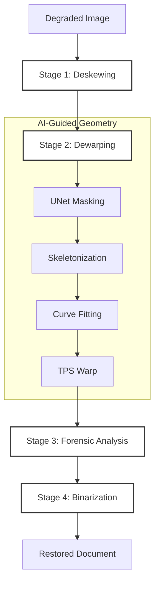

Summary: This README provides a comprehensive overview of a hybrid ancient document restoration framework. The project emphasizes a low-cost, verifiable approach that combines classical mathematical algorithms with targeted Deep Learning (DL) assistance, avoiding the "black-box" nature of end-to-end AI generation.

---

# HYBRID FRAMEWORK FOR ANCIENT DOCUMENT RESTORATION

## A Low-Cost Approach Combining Classical Geometry and Deep Learning

## 1. PROJECT OVERVIEW

This project presents a specialized pipeline for the restoration of degraded and physically distorted ancient documents. Unlike contemporary "End-to-End" AI models that generate images from scratch—often leading to historical hallucinations—this framework utilizes AI strictly for structural feature extraction.

The core philosophy is **AI-as-an-Assistant**:

* **Minimal Computational Cost**: Only a lightweight model is used for mask detection.
* **Geometric Integrity**: Restoration is handled by deterministic mathematical transformations.
* **Verifiability**: Each stage of the pipeline produces measurable, traceable results similar to a scientific verification study.

Design Philosophy: **Why not End-to-End AI?**

* Most modern restoration projects use Generative AI (GANs/Diffusion) which often "hallucinates" or creates fake details in ancient scripts. Our project uses a Geometric Constraint Approach:

  * AI for Perception: UNet only identifies where the text is.

  * Math for Transformation: TPS and Polynomial fitting ensure the original pixels are simply moved back to their rightful place, preserving 100% historical authenticity.
## 2. RESTORATION PIPELINE

The restoration process is executed through four distinct, sequential stages:

### Stage 1: Deskewing

To correct global rotation, the system employs the **Probabilistic Hough Transform**. By detecting the dominant orientations of text-line segments, the algorithm calculates the precise skew angle and performs a compensatory rotation to align the document to a horizontal baseline.

### Stage 2: Dewarping (AI-Guided Geometric Correction)

This stage rectifies non-linear distortions (e.g., page curls and folds) using a multi-step geometric process:

1. **Mask Detection**: A Deep Learning model (U-Net) identifies the precise pixel-area of text lines.
2. **Skeletonization**: The detected masks are reduced to one-pixel wide centerlines (skeletons).
3. **Curve Fitting**: Polynomial or spline-based functions are fitted to these skeletons to model the physical warp of the paper.
4. **TPS Dewarp**: **Thin Plate Spline (TPS)** transformation is applied to warp the entire image back into a flat, rectified plane based on the fitted curves.

### Stage 3: Forensic Analysis (Background Separation)

To isolate text from stains, aging artifacts, and uneven lighting:

* **Division Normalization (DN)**: Estimating the illumination layer and dividing the original image by it to achieve a uniform background.
* **Enhancement**: Implementation of **CLAHE** (Contrast Limited Adaptive Histogram Equalization) or **ZCA Whitening** (Zero-phase Component Analysis) to sharpen faint ink traces and decorrelate noise.

### Stage 4: Mask-Driven Binarization

The final stage converts the image to high-contrast black and white:

* The system utilizes the **AI-generated Mask** from Stage 2 as a spatial filter.
* **Content Preservation**: Pixels within the mask boundaries undergo adaptive binarization to retain stroke details.
* **Background Cleaning**: All pixels outside the mask are programmatically set to pure white (), ensuring a perfectly clean output for OCR engines.

## 3. TRAINING PERFORMANCE

The AI component is trained solely to identify text-line masks, significantly reducing the required training data and time compared to generative models.

| Metric | Value |
| --- | --- |
| Training Loss | 0.0449 |
| Validation Loss | 0.0636 |
| Mask mIoU | 0.8562 |
| Mask F1 Score | 0.9223 |
| Mask PA | 0.988 |

## 4. EXPERIMENTAL RESULTS
### MASK AI

### Visual Restoration Results

The following section demonstrates the transition from a distorted, low-contrast original to a rectified, binarized output.

* (Recommended: Comparison of Original -> Dewarped -> Forensic -> Binarized)

### Quantitative Evaluation

We evaluate the quality of the restoration by measuring the accuracy of text extraction using two primary metrics: **Character Error Rate (CER)** and **Word Error Rate (WER)**.

| Processing Stage | CER (%) | WER (%) |
| --- | --- | --- |
| Original Scan | 247 | 130 |
| **Post-Restoration** | **110** | **95** |

## 5. REPOSITORY STRUCTURE

* `src/core/deskewer.py`: Implementation of Probabilistic Hough Transform.
* `src/core/dewarp.py`: Logic for Skeletonization, Curve Fitting, and TPS.
* `src/core/forensic.py`: Division Normalization and ZCA modules.
* `src/core/ai_model.py`: Architecture for the Mask Detection model.
* `src/utils/metrics.py`: Calculation tools for CER and WER.

## 6. CONCLUSION

By constraining Deep Learning to structural detection and relying on classical mathematics for image transformation, this project provides a robust, low-cost, and transparent solution for document restoration. This hybrid approach ensures that the historical "truth" of the document is preserved without the artifacts typically introduced by purely generative AI.

---

